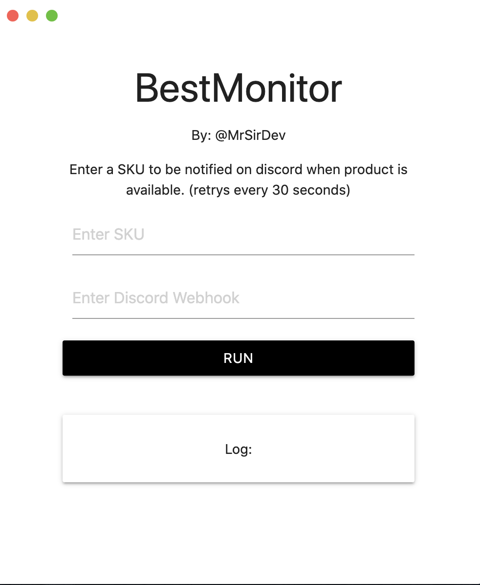

# BestMonitor



Open source project to watch a certain product and get a notification on discord when said product is available. Has somewhat of a GUI interface with an easy setup.

## Prerequisites

Have the following installed:

[Node (LTS)](https://nodejs.org/en/) 12.17.0

### Installing

```
git clone https://github.com/MrSirDev/bestbuy-open-source.git

npm install or npm i

npm start or npm dev
```

### Setup

Enter field `sku` with any sku for example **"6411492"**

Then enter `discord webhook` with your discord webhook.

Press `Run` and watch the magic happen.

NOTE: Bot is set to search for stock every minute you can change that but be warned for banning of IP.
